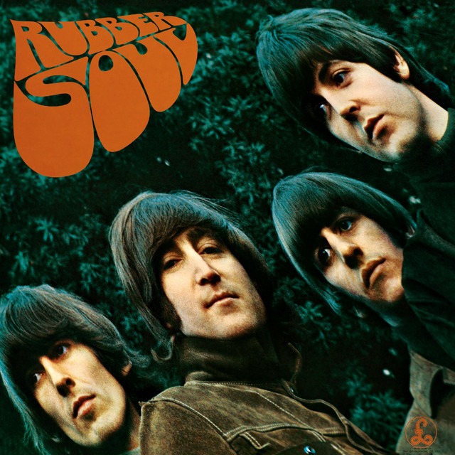

# CPU IIR Blur

2D blur example using a 2nd order IIR lowpass filter.

## Example

    $ ./IIR-CPU-Blur Rubber-Soul.png 5

### Before

### After

## Build

    $ cd src
    $ meson setup build
    $ cd build
    $ meson compile
    
## Libs

[LodePNG](https://github.com/lvandeve/lodepng) (For reading and writting PNG images)
